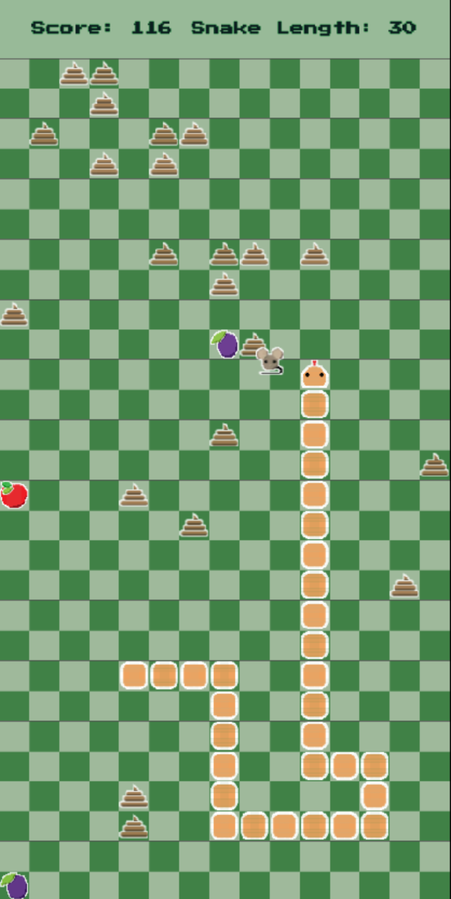

# Ekans

The Reverse Snake Game

## Overview
Welcome to Ekans, a unique twist on the classic Snake game. Developed using Godot and GDScript, Ekans reverses the traditional mechanics of Snake by starting the player with a fully grown snake that shrinks as it eats food. As the snake shrinks, it drops poops that clutter the map, creating deadly obstacles that increase the difficulty. 

## Features
- **Reverse Snake Mechanics:** Start with a fully grown snake and shrink by eating food.
- **Dynamic Obstacles:** Poops are dropped as the snake shrinks, becoming deadly obstacles.
- **Intuitive Controls:** Smooth and responsive controls for a seamless gameplay experience.
- **Challenging Gameplay:** Increasing difficulty as the map gets cluttered with more obstacles.
- **Optimised For Mobile:** Game was design with mobile usage in mind, and has a compiled mobile version.

## Screenshots

</br>
*Caption: A snapshot of Ekans gameplay.*

## Getting Started

### Prerequisites
- [Godot Engine](https://godotengine.org/download) (version 4 or later)

### Installation

1. **Clone the Repository:**

   ```bash
   git clone https://github.com/house-of-the-badger/ekansREBORN.git
   cd ekansREBORN
   ```
   
2. **Open with Godot:**
    - Launch the Godot Engine.
    - Click on "Import" and navigate to the cloned `ekansREBORN` directory.
    - Select the `project.godot` file to open the project.

### Running the Game

- Click the "Play" button in Godot to run the game.

### Play on Android

- Navigate to https://github.com/house-of-the-badger/ekansREBORN/tree/master/android-app
- Download the apk file
- Install the game on your android device

## How to Play

1. **Objective:** Shrink the snake by eating food.
2. **Controls:** Use the arrow keys (or swipe on mobile) to move the snake.
3. **Avoid Obstacles:** Don't collide with the poops left by the shrinking snake—they're deadly!

## Team

- **Danielle Dawson**
- **Josh Burnlees**
- **Nikoo Farsi**
- **Kris Oldrini**
- **Anna Veselova**
- **Kim Muncey**

---

This portfolio project was created as part of a Digital Skills Bootcamp in Software Engineering provided by [Northcoders](https://northcoders.com/)